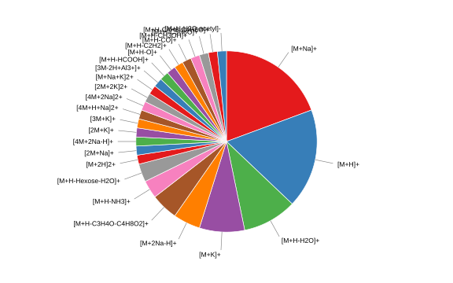

# Using commonMZ rules with CAMERA

CAMERA’s
[`findAdducts()`](https://rdrr.io/pkg/CAMERA/man/findAdducts-methods.html)
function needs a table of adduct and fragment rules: one row per rule,
with columns `name`, `nmol`, `charge`, `massdiff`, `oidscore`, `quasi`,
and `ips`.
[`MZ_CAMERA()`](https://stanstrup.github.io/commonMZ/reference/MZ_CAMERA.md)
builds exactly that table from commonMZ’s curated `adducts_fragments`
dataset.

The seven columns are defined as follows. `name`, `nmol`, `charge`, and
`massdiff` are described in Kuhl et al. (2012); `oidscore`, `quasi`, and
`ips` are documented only in the CAMERA source code.

| Column | Type | Meaning |
|----|----|----|
| `name` | character | Ion label (e.g. `[M+H]+`). |
| `nmol` | integer | Molecules per ion (1 = monomer, 2 = dimer). |
| `charge` | integer | Signed ion charge. |
| `massdiff` | numeric (Da) | Mass added by the adduct (compared to neutral mass) or lost as a neutral fragment. |
| `oidscore` | integer | Groups rules that share the same adduct formula but differ in `nmol` (e.g. `[M+H]+` and `[2M+H]+`). CAMERA uses it to automatically extend a monomer match to the corresponding dimer/trimer hypotheses. |
| `quasi` | 0 / 1 | **Mandatory ion flag.** If no rule with `quasi = 1` appears in a candidate group, CAMERA discards the whole group. Typically only the primary protonated ion carries `quasi = 1`. |
| `ips` | numeric | **Ion/adduct peak score** (~0.25–1). Confidence weight per rule. When a peak fits multiple competing mass hypotheses, CAMERA sums `ips` within each group and discards the lower-scoring one. Typical values: 1.0 for `[M+H]+`, 0.5 for multiply-charged ions, 0.25 for neutral losses. |

## Building the rules table

[`MZ_CAMERA()`](https://stanstrup.github.io/commonMZ/reference/MZ_CAMERA.md)
accepts three modes: `"pos"` for positive-ion LC-MS, `"neg"` for
negative-ion LC-MS, and `"ei"` for electron-ionisation GC-MS. The
`warn_clash` argument flags pairs of rules whose mass differences fall
within a given ppm tolerance of each other and cannot be distinguished
on mass alone.

### Positive mode

``` r

rules_pos <- MZ_CAMERA(mode = "pos", warn_clash = TRUE, clash_ppm = 5)
```

    # A tibble: 2 × 2
      first       second
      <chr>       <chr>
    1 [M+H-NH3]+  [M+NH4]+
    2 [M+H-C3H4]+ [M+H+(CH3)2CO-H2O]+ (acetone cond.)


    Consider removing one of them. Example:
     rules=rules[            !grepl("[M+NH4]+",rules[,"name"],fixed=TRUE)         ,]

Browse the full table — sort any column or use the search box to filter
by name or mass difference:

``` r

rules_pos %>% mutate(massdiff = round(massdiff, 4))
```

### Negative mode

``` r

rules_neg <- MZ_CAMERA(mode = "neg", warn_clash = TRUE, clash_ppm = 5)
```

    # A tibble: 2 × 2
      first        second
      <chr>        <chr>
    1 [M-H-HCOOH]- [M-H+HCOOH]-
    2 [M-H-C3H4]-  [M-H+(CH3)2CO-H2O]- (acetone cond.)


    Consider removing one of them. Example:
     rules=rules[            !grepl("[M+NH4]+",rules[,"name"],fixed=TRUE)         ,]

``` r

nrow(rules_neg)
```

    [1] 147

Show code

``` r

rules_neg %>% mutate(massdiff = round(massdiff, 4))
```

### Electron ionisation (EI)

Show code

``` r

rules_ei <- MZ_CAMERA(mode = "ei", warn_clash = FALSE)
```

## The NH₄⁺ clash

A common clash in positive mode: `[M+NH4]+` and neutral loss of NH₃
produce the same 17.027 Da difference and cannot be distinguished on
mass alone. The warning from `warn_clash = TRUE` flags this. If NH₄⁺
adducts are rare in your matrix (common for many reversed-phase LC-MS
setups), remove them before passing the rules to CAMERA:

``` r

rules_pos_clean <- rules_pos %>% filter(name != "[M+NH4]+")
```

## Annotating peaks: mm14 example

The example below uses `mm14`, the xcmsSet bundled with the CAMERA
package (134 peaks, single sample, positive mode). For your own data,
replace `mm14` with your xcmsSet from `xcms` peak detection.

**Step 1 — create an `xsAnnotate` object:**

``` r

library(CAMERA)

data("mm14")
xsa <- xsAnnotate(mm14, polarity = "positive")
```

**Step 2 — group co-eluting peaks** by retention time window
(FWHM-based):

``` r

xsaF <- groupFWHM(xsa, perfwhm = 0.6, intval = "into")
```

For multi-sample data a cross-sample correlation step refines groups
further:

``` r

xsaF <- groupCorr(xsaF, cor_eic_th = 0.7, pval = 1e-6,
                  calcIso = FALSE, calcCiS = FALSE, calcCaS = TRUE)
```

**Step 3 — annotate isotope peaks:**

``` r

xsaI <- findIsotopes(xsaF, ppm = 10, mzabs = 0.01, intval = "into")
```

**Step 4 — annotate adducts and fragments** with commonMZ rules. CAMERA
requires a plain `data.frame`, not a tibble, so wrap with
[`as.data.frame()`](https://rdrr.io/r/base/as.data.frame.html):

``` r

cam_result <- findAdducts(xsaI,
                          ppm        = 10,
                          mzabs      = 0.01,
                          multiplier = 3,
                          polarity   = "positive",
                          rules      = as.data.frame(rules_pos_clean))
```

`multiplier` controls the highest oligomer CAMERA will consider
(e.g. `[2M+H]+`, `[3M+H]+`). `ppm` and `mzabs` set the matching
tolerance; CAMERA applies whichever window is wider, so for
high-resolution data keep `mzabs` small (0.005–0.01) and rely on `ppm`.

## Annotated peak table

[`getPeaklist()`](https://rdrr.io/pkg/CAMERA/man/getPeaklist-methods.html)
returns one row per feature with annotation columns appended. The
`adduct` column shows the best-matching rule for each feature; features
with no match are left blank. Features with the same `pcgroup` number
are assumed to originate from the same parent molecule.

Show code

``` r

peaklist <- getPeaklist(cam_result)
peaklist %>%
  select(mz, rt, any_of(c("isotopes", "adduct", "pcgroup")), starts_with("sample")) %>%
  mutate(pcgroup = as.integer(pcgroup)) %>%
  arrange(pcgroup, mz) %>%
  mutate(mz = round(mz, 4), rt = round(rt, 1))
```

## Which rules fired?

After annotation, count how often each rule was assigned. Rules that
fired zero times are either absent from this matrix or could not be
resolved within the tolerance.

We can make a simple pie chart:

Show code

``` r

camera_pie(cam_result)
```



Or a fancy Sankey chart:

Show code

``` r

camera_sankey(cam_result)
```
