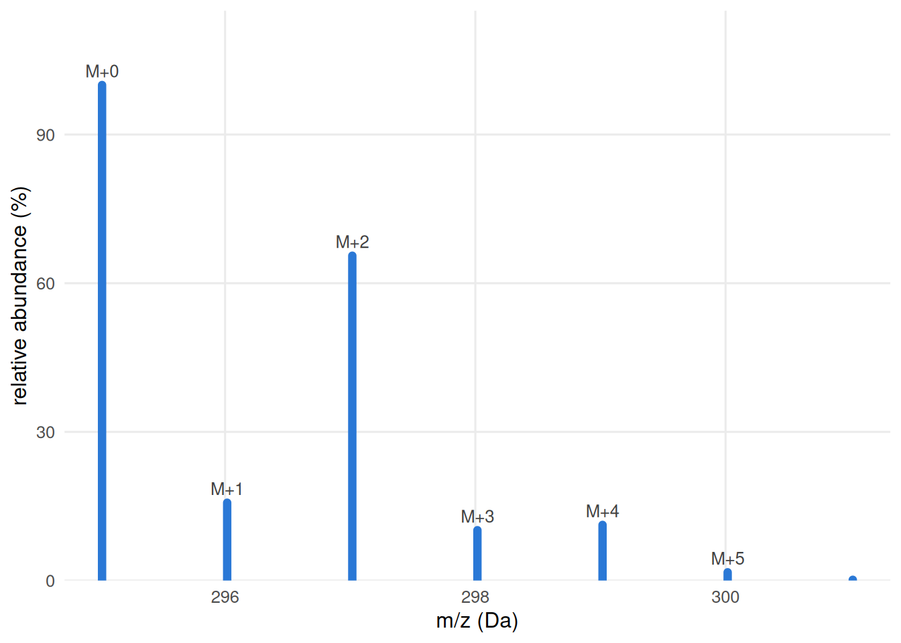
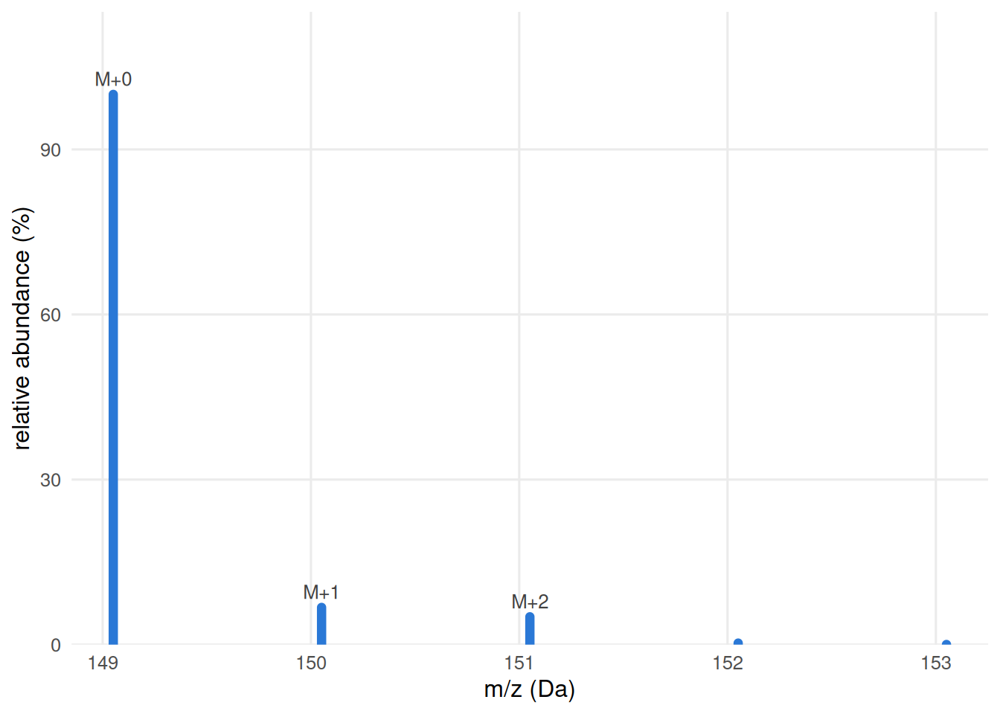
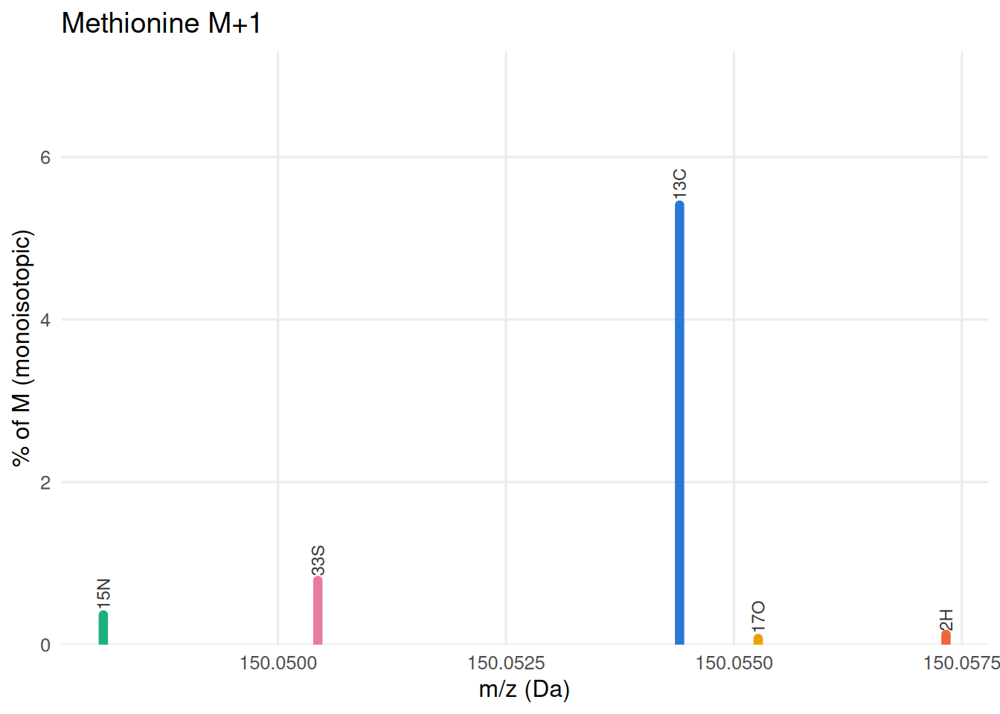
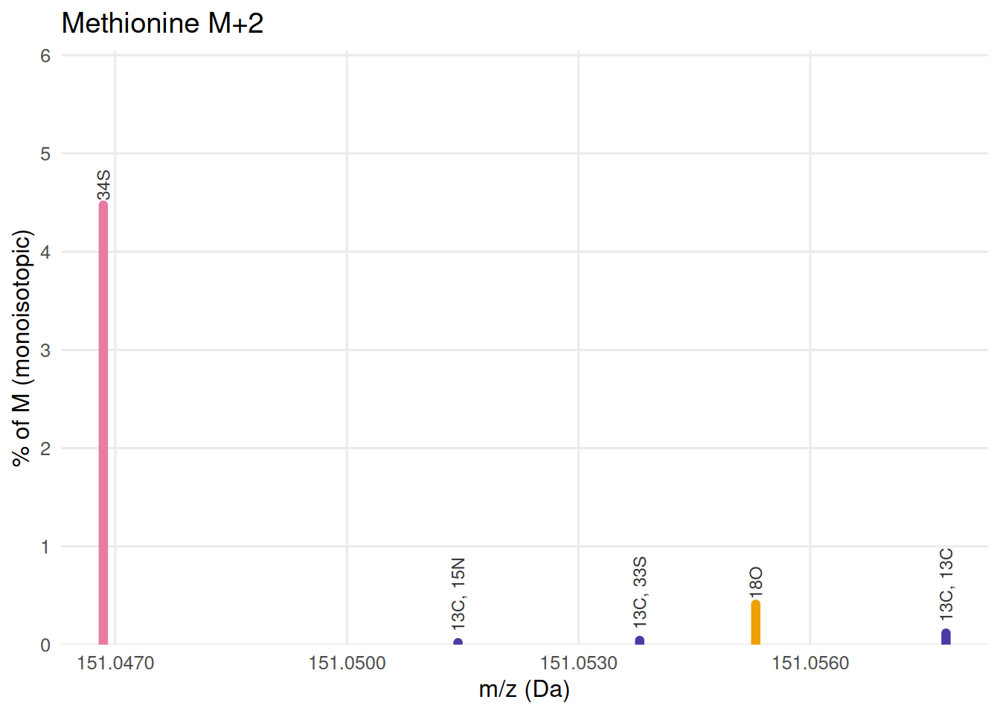

# Reading isotopic fine structure

## Chlorine’s M+2: an abundance effect

Chlorine has two stable isotopes: ³⁵Cl (75.8% natural abundance,
monoisotopic) and ³⁷Cl (24.2%). A molecule with two chlorines – like
**diclofenac** (C₁₄H₁₁Cl₂NO₂) – has roughly a 37% chance of carrying
exactly one ³⁷Cl, placing that molecule at M+2. The monoisotopic M peak
is simultaneously thinned out as ions scatter across M+1, M+2, M+3 and
M+4 – so M+2 ends up at ~65% of M, an excess so large that no
fine-structure argument is required to recognize it.

``` r

pat_dic <- isotope_fine_pattern("C14H11Cl2NO2")
base_dic <- pat_dic %>% filter(label == "") %>% pull(mz)

coarse_dic <- pat_dic %>%
  mutate(nominal = round(mz - base_dic)) %>%
  group_by(nominal) %>%
  summarise(mz = base_dic + first(nominal), abundance = sum(abundance), .groups = "drop")

ggplot(coarse_dic, aes(mz, abundance)) +
  geom_segment(aes(xend = mz, y = 0, yend = abundance),
               colour = BLUE, linewidth = 2.2, lineend = "round") +
  geom_text(data = filter(coarse_dic, abundance > 1),
            aes(label = paste0("M+", nominal)),
            vjust = -0.6, size = 3.4, colour = "grey25") +
  scale_y_continuous(limits = c(0, NA), expand = expansion(mult = c(0, .15))) +
  labs(x = "m/z (Da)", y = "relative abundance (%)") +
  theme_minimal(base_size = 12) +
  theme(panel.grid.minor = element_blank())
```



Diclofenac’s isotope pattern at unit resolution. Two chlorines are
unmissable without any fine-structure argument at all.

That coarse view is
[`isotope_fine_pattern()`](https://stanstrup.github.io/commonMZ/reference/isotope_fine_pattern.md)’s
output summed by nominal mass – the same number every isotope-pattern
calculator reports. M+2 at ~65% follows directly from ³⁷Cl’s 24.2%
natural abundance.

## Why different elements land at different exact masses

A “nominal +2” peak contains any isotopologue whose mass rounds to 2 Da
above the monoisotopic peak. But exact masses differ: nuclear binding
energy – the energy released when protons and neutrons form a nucleus –
varies between nuclei, so the heavy isotope of each element sits at its
own characteristic offset from the nearest integer.

| Isotopologue | Shift from monoisotopic (Da) | Offset from nominal +2 (mDa) |
|--------------|-----------------------------:|-----------------------------:|
| ¹³C + ¹³C    |                      +2.0067 |                         +6.7 |
| ¹⁸O          |                      +2.0042 |                         +4.2 |
| ³⁷Cl         |                      +1.9971 |                         −2.9 |
| ³⁴S          |                      +1.9958 |                         −4.2 |

The 10.9 mDa gap between ¹³C¹³C and ³⁴S is larger than the mass accuracy
of any modern high-resolution instrument: they are at genuinely
different masses. Whether your spectrum actually resolves them as two
peaks rather than one depends on resolving power – which the sections
below work through for a concrete example.

## When the coarse pattern hides the answer

**Methionine**, C₅H₁₁NO₂S, is about as ordinary as a metabolite gets,
one of the twenty proteinogenic amino acids, present in every untargeted
metabolomics urine or plasma run. It also carries one sulfur, and
sulfur’s own +2 isotope, ³⁴S, sits at 4.25% abundance, two orders of
magnitude more abundant than the +1 isotopes of the CHNO elements.
Nothing about a coarse M+1/M+2 barcode makes that obvious the way
diclofenac’s two chlorines are obvious.

``` r

pat_met <- isotope_fine_pattern("C5H11NO2S")
base_met <- pat_met %>% filter(label == "") %>% pull(mz)

coarse_met <- pat_met %>%
  mutate(nominal = round(mz - base_met)) %>%
  group_by(nominal) %>%
  summarise(mz = base_met + first(nominal), abundance = sum(abundance), .groups = "drop")

ggplot(coarse_met, aes(mz, abundance)) +
  geom_segment(aes(xend = mz, y = 0, yend = abundance),
               colour = BLUE, linewidth = 2.2, lineend = "round") +
  geom_text(data = filter(coarse_met, abundance > 1),
            aes(label = paste0("M+", nominal)),
            vjust = -0.6, size = 3.4, colour = "grey25") +
  scale_y_continuous(limits = c(0, NA), expand = expansion(mult = c(0, .15))) +
  labs(x = "m/z (Da)", y = "relative abundance (%)") +
  theme_minimal(base_size = 12) +
  theme(panel.grid.minor = element_blank())
```



Methionine’s coarse isotope pattern. M+2 is bigger than five carbons
alone would ever produce - but the bars alone don’t say why.

Five carbons predict an M+1 of roughly `5 * 1.07% ≈ 5.4%` of M,
reasonably close to what the chart shows, since carbon dominates M+1 for
any CHNOS compound this size. But M+2 at 5.1% is the number that should
make you stop: naively, M+2 “ought” to come from picking any two of
those five carbons to both be ¹³C, which combinatorics puts at only
`choose(5,2) * 0.0107^2 * 100 ≈ 0.11%`, **roughly 40 times smaller**
than what is actually observed. Something other than double-¹³C is
producing most of that peak, and the coarse pattern alone cannot tell
you what. That gap between the naive ¹³C-only prediction and the
observed M+2 height is itself a diagnostic: whenever M+2 badly
overshoots what carbon alone predicts, suspect S, Cl, Br, Si, or a metal
before anything else.

## What is actually inside methionine’s M+2

[`isotope_fine_pattern()`](https://stanstrup.github.io/commonMZ/reference/isotope_fine_pattern.md)
reports each isotopologue separately, at its own exact mass, labelled by
which isotopes produced it:

``` r

pat_met %>% arrange(mz) %>%
  mutate(mz = round(mz, 5), abundance = round(abundance, 4),
         label = ifelse(label == "", "M (monoisotopic)", label)) %>%
  knitr::kable(caption = "Every isotopologue of methionine above the default 0.01% threshold.")
```

|       mz | abundance | label            |
|---------:|----------:|:-----------------|
| 149.0511 |  100.0000 | M (monoisotopic) |
| 150.0481 |    0.3653 | 15N              |
| 150.0504 |    0.7896 | 33S              |
| 150.0544 |    5.4079 | 13C              |
| 150.0553 |    0.0762 | 17O              |
| 150.0573 |    0.1265 | 2H               |
| 151.0469 |    4.4742 | 34S              |
| 151.0514 |    0.0198 | 13C, 15N         |
| 151.0538 |    0.0427 | 13C, 33S         |
| 151.0553 |    0.4110 | 18O              |
| 151.0578 |    0.1170 | 13C, 13C         |
| 152.0439 |    0.0163 | 15N, 34S         |
| 152.0502 |    0.2420 | 13C, 34S         |
| 152.0587 |    0.0222 | 13C, 18O         |
| 153.0461 |    0.0105 | 36S              |
| 153.0511 |    0.0184 | 18O, 34S         |

Every isotopologue of methionine above the default 0.01% threshold.
{.table .caption-top}

On the m/z axis, the M+1 and M+2 regions each split into several
distinct peaks:

``` r

plot_level <- function(pattern, level, title) {
  base <- pattern %>% filter(label == "") %>% pull(mz)
  d <- pattern %>% mutate(nominal = round(mz - base)) %>% filter(nominal == level) %>%
    mutate(element = sub(",.*", "", label), element = sub("^[0-9]+", "", element),
           col = ifelse(label == "" | grepl(",", label), "combo", element),
           col = ifelse(col %in% names(COL), col, "combo"))
  ggplot(d, aes(mz, abundance, colour = col)) +
    geom_segment(aes(xend = mz, y = 0, yend = abundance),
                 linewidth = 2.2, lineend = "round") +
    geom_text(data = slice_max(d, abundance, n = min(6, nrow(d))),
              aes(label = label),
              angle = 90, hjust = -0.15, size = 3.1, colour = "grey20") +
    scale_colour_manual(values = COL, guide = "none") +
    scale_x_continuous(labels = scales::label_number(accuracy = 0.0001)) +
    scale_y_continuous(limits = c(0, NA), expand = expansion(mult = c(0, .35))) +
    labs(x = "m/z (Da)", y = "% of M (monoisotopic)", title = title) +
    theme_minimal(base_size = 12) +
    theme(panel.grid.minor = element_blank())
}
plot_level(pat_met, 1, "Methionine M+1")
```



Methionine, M+1: five candidate isotope substitutions, spread across
0.009 Da. Carbon dominates, as it does for almost every organic ion.

``` r

plot_level(pat_met, 2, "Methionine M+2")
```



Methionine, M+2: 34S alone outweighs every carbon-only combination
roughly 40-fold, exactly matching the excess spotted in the coarse
pattern above.

Two things the coarse bar chart could never show are visible here.
First, **sulfur’s own +2 isotope physically sits apart from every
carbon-based explanation**: `13C, 13C` (two different carbons, both ¹³C)
sits 0.01091 Da away from `34S`, a large enough gap that they are two
genuinely different masses, not two names for the same peak. Second, the
height difference *is* the sulfur signal: `34S` towers over every
combination of carbons, nitrogens and oxygens that could also reach +2,
which is the fine-structure version of the 40-fold excess already
spotted in the coarse pattern, now with a specific competing hypothesis
(¹³C¹³C) at a specific, different mass instead of a vague “something
else.”

## Whether you’d actually see it depends on resolving power

A mass difference on paper is not the same as two resolved peaks on a
chromatogram. Whether `34S` and `13C, 13C` show up as one blob or two
depends entirely on the resolving power available at that m/z. Resolving
power is not a fixed number: Orbitraps are quoted at a reference m/z
(typically 200) and lose resolving power roughly as `1/sqrt(m/z)` away
from it.
[`isotope_profile()`](https://stanstrup.github.io/commonMZ/reference/isotope_profile.md)
turns that into a picture rather than an abstraction, by summing a
Gaussian peak of the right width for each isotopologue and showing what
the region would actually look like at a chosen resolving power:

``` r

R_at_mz <- function(mz, R_ref, mz_ref = 200) R_ref * sqrt(mz_ref / mz)

Rs <- c(15000, 60000, 120000)
R_label <- function(r) sprintf("R = %s @200", format(r, big.mark = ",", trim = TRUE))
pat_met2 <- pat_met %>% mutate(nominal = round(mz - base_met)) %>% filter(nominal == 2)

prof <- map_dfr(Rs, function(r)
  isotope_profile(pat_met2, resolution = R_at_mz(mean(pat_met2$mz), r)) %>%
    mutate(R = R_label(r)))
ticks <- pat_met2 %>% filter(abundance > 0.02)

p <- ggplot(prof, aes(mz, intensity)) +
  geom_area(fill = BLUE, alpha = .25) +
  geom_line(colour = BLUE, linewidth = .8) +
  geom_rug(data = ticks, aes(x = mz),
           inherit.aes = FALSE, sides = "b", colour = "grey30", linewidth = .6) +
  facet_wrap(~ factor(R, levels = map_chr(Rs, R_label)), ncol = 1, scales = "free_y") +
  scale_x_continuous(labels = scales::label_number(accuracy = 0.0001)) +
  labs(x = "m/z (Da)", y = "simulated intensity (% of M)") +
  theme_minimal(base_size = 12) +
  theme(panel.grid.minor = element_blank(), strip.text = element_text(hjust = 0))
ggplotly(p, tooltip = c("x", "y"))
```

Methionine’s M+2 region simulated at three Orbitrap resolving powers
(quoted @ m/z 200). Vertical ticks mark where each candidate actually
sits. At 15,000 the shoulder is invisible; by 60,000 it is unambiguous.

At 15,000 the ³⁴S peak is a single, slightly lopsided blob; the ¹³C¹³C
shoulder is in there, but you cannot see it. By 60,000 it is an
unmistakable second peak. This is the actual lesson of fine structure:
it is not a yes/no property of a molecule, it is a question you can only
answer once you know both *what* could be there and *whether your
instrument could show it to you*.

## Where to go from here

This document covered the *why*: the arithmetic behind a mass defect and
why resolving power changes what you can conclude from a spectrum. Two
companion vignettes turn that understanding into a workflow you can run
on your own data:

- [**Simulating isotope fine structure for a
  formula**](https://stanstrup.github.io/commonMZ/articles/isotope-fine-structure-tool.md):
  given a candidate formula, get its full fine-structure table, a
  resolving-power calculator for every pair of candidates, and a
  simulated profile at your own instrument’s settings.
- [**Looking up an unexplained mass
  difference**](https://stanstrup.github.io/commonMZ/articles/mass-difference-lookup.md):
  the opposite problem: you have a delta between two peaks and no
  formula yet, and want to search it against every known adduct,
  in-source fragment and repeating-unit difference in commonMZ at once.
