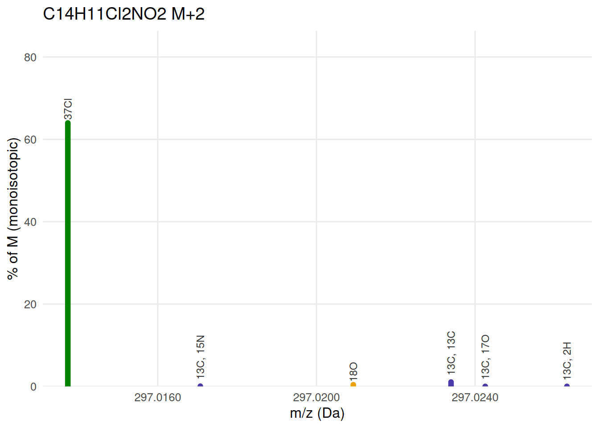

# Simulating isotope fine structure for a formula

``` r

library(commonMZ)
library(dplyr)
```


    Attaching package: 'dplyr'

    The following objects are masked from 'package:stats':

        filter, lag

    The following objects are masked from 'package:base':

        intersect, setdiff, setequal, union

``` r

library(purrr)
library(ggplot2)
library(plotly)
```


    Attaching package: 'plotly'

    The following object is masked from 'package:ggplot2':

        last_plot

    The following object is masked from 'package:stats':

        filter

    The following object is masked from 'package:graphics':

        layout

``` r

BLUE <- "#2a78d6"
COL  <- c(C = "#2a78d6", H = "#eb6834", N = "#1baf7a", O = "#eda100",
         S = "#e87ba4", Cl = "#008300", combo = "#4a3aa7")
```

This is the practical companion to [*Reading isotopic fine
structure*](https://stanstrup.github.io/commonMZ/articles/isotope-fine-structure-explained.md),
which explains the concept using methionine as a worked example. Here
the goal is a recipe you can run on any formula of your own: build the
fine structure, check whether your instrument would resolve the
candidates that matter, and see the simulated peak shape at your own
resolving power.

## Step 1 — build the fine structure

Swap in your own candidate formula here:

``` r

formula <- "C14H11Cl2NO2"   # diclofenac -- replace with your own candidate

pat <- isotope_fine_pattern(formula)
pat %>% arrange(mz) %>%
  mutate(mz = round(mz, 5), abundance = round(abundance, 4),
         label = ifelse(label == "", "M (monoisotopic)", label)) %>%
  knitr::kable(caption = paste("Every isotopologue of", formula, "above the default 0.01% threshold."))
```

|       mz | abundance | label                |
|---------:|----------:|:---------------------|
| 295.0167 |  100.0000 | M (monoisotopic)     |
| 296.0137 |    0.3653 | 15N                  |
| 296.0200 |   15.1420 | 13C                  |
| 296.0209 |    0.0762 | 17O                  |
| 296.0230 |    0.1265 | 2H                   |
| 297.0137 |   63.9916 | 37Cl                 |
| 297.0171 |    0.0553 | 13C, 15N             |
| 297.0209 |    0.4110 | 18O                  |
| 297.0234 |    1.0645 | 13C, 13C             |
| 297.0243 |    0.0115 | 13C, 17O             |
| 297.0263 |    0.0192 | 13C, 2H              |
| 298.0108 |    0.2338 | 37Cl, 15N            |
| 298.0171 |    9.6896 | 13C, 37Cl            |
| 298.0179 |    0.0488 | 37Cl, 17O            |
| 298.0200 |    0.0810 | 2H, 37Cl             |
| 298.0243 |    0.0622 | 13C, 18O             |
| 298.0267 |    0.0461 | 13C, 13C, 13C        |
| 299.0108 |   10.2373 | 37Cl, 37Cl           |
| 299.0141 |    0.0354 | 13C, 37Cl, 15N       |
| 299.0180 |    0.2630 | 37Cl, 18O            |
| 299.0204 |    0.6812 | 13C, 13C, 37Cl       |
| 299.0234 |    0.0123 | 13C, 2H, 37Cl        |
| 300.0078 |    0.0374 | 37Cl, 37Cl, 15N      |
| 300.0141 |    1.5501 | 13C, 37Cl, 37Cl      |
| 300.0171 |    0.0130 | 2H, 37Cl, 37Cl       |
| 300.0213 |    0.0398 | 13C, 37Cl, 18O       |
| 300.0238 |    0.0295 | 13C, 13C, 13C, 37Cl  |
| 301.0150 |    0.0421 | 37Cl, 37Cl, 18O      |
| 301.0175 |    0.1090 | 13C, 13C, 37Cl, 37Cl |

Every isotopologue of C14H11Cl2NO2 above the default 0.01% threshold.
{.table .caption-top}

Grouping by nominal mass reproduces the coarse M/M+1/M+2 pattern any
calculator would give you — diclofenac’s two chlorines make this one
unambiguous even at unit resolution:

``` r

base_mz <- pat %>% filter(label == "") %>% pull(mz)
coarse <- pat %>% mutate(nominal = round(mz - base_mz)) %>%
  group_by(nominal) %>%
  summarise(mz = base_mz + first(nominal), abundance = sum(abundance), .groups = "drop")

ggplot(coarse, aes(mz, abundance)) +
  geom_segment(aes(xend = mz, y = 0, yend = abundance), colour = BLUE, linewidth = 2.2,
               lineend = "round") +
  geom_text(data = filter(coarse, abundance > 1), aes(label = paste0("M+", nominal)),
            vjust = -0.6, size = 3.4, colour = "grey25") +
  scale_y_continuous(limits = c(0, NA), expand = expansion(mult = c(0, .15))) +
  labs(x = "m/z (Da)", y = "relative abundance (%)") +
  theme_minimal(base_size = 12) +
  theme(panel.grid.minor = element_blank())
```


Diclofenac’s coarse isotope pattern: two chlorines produce a textbook
M/M+2/M+4 barcode.

## Step 2 — zoom into one nominal level

Plotting the isotopologues of a single nominal level directly on the m/z
axis shows what is really inside it — here M+2, where a 37Cl
isotopologue dominates so completely that a small 13C,13C shoulder is
almost invisible on a linear scale:

``` r

plot_level <- function(pattern, level, title) {
  base <- pattern %>% filter(label == "") %>% pull(mz)
  d <- pattern %>% mutate(nominal = round(mz - base)) %>% filter(nominal == level) %>%
    mutate(element = sub(",.*", "", label), element = sub("^[0-9]+", "", element),
           col = ifelse(label == "" | grepl(",", label), "combo", element),
           col = ifelse(col %in% names(COL), col, "combo"))
  ggplot(d, aes(mz, abundance, colour = col)) +
    geom_segment(aes(xend = mz, y = 0, yend = abundance), linewidth = 2.2, lineend = "round") +
    geom_text(data = slice_max(d, abundance, n = min(6, nrow(d))),
              aes(label = label), angle = 90, hjust = -0.15, size = 3.1, colour = "grey20") +
    scale_colour_manual(values = COL, guide = "none") +
    scale_x_continuous(labels = scales::label_number(accuracy = 0.0001)) +
    scale_y_continuous(limits = c(0, NA), expand = expansion(mult = c(0, .35))) +
    labs(x = "m/z (Da)", y = "% of M (monoisotopic)", title = title) +
    theme_minimal(base_size = 12) +
    theme(panel.grid.minor = element_blank())
}
plot_level(pat, 2, paste(formula, "M+2"))
```



Diclofenac M+2: two chlorines dominate so completely that the tiny
13C,13C shoulder barely registers, even though it sits at a perfectly
resolvable distance.

## Step 3 — would your instrument resolve the candidates?

For every pair of isotopologues at a nominal level the table below
reports the resolving power (Orbitrap convention, quoted at m/z 200) at
which the two Gaussian peaks would show a ~50% valley between them —
enough for a centroid algorithm to find two separate peaks. Two Gaussian
peaks of equal height separated by 1.5 × FWHM produce a valley at about
50% of peak height; translating that to the R@200 Orbitrap convention
scales as `1/sqrt(m/z)`:

``` r

R_at_mz <- function(mz, R_ref, mz_ref = 200) R_ref * sqrt(mz_ref / mz)

separations <- function(pattern, level, mz_ref = 200, min_abundance = 0.01) {
  base <- pattern %>% filter(label == "") %>% pull(mz)
  d <- pattern %>% mutate(nominal = round(mz - base)) %>%
    filter(nominal == level, abundance >= min_abundance) %>%
    mutate(label = ifelse(label == "", "M", label))
  if (nrow(d) < 2) return(tibble())
  ix <- combn(seq_len(nrow(d)), 2)
  map_dfr(seq_len(ncol(ix)), function(i) {
    ra <- d[ix[1, i], ]; rb <- d[ix[2, i], ]
    sep_da  <- abs(ra$mz - rb$mz)
    m_avg   <- (ra$mz + rb$mz) / 2
    Rreq    <- 1.5 * m_avg / sep_da              # R at this m/z for ~50% valley
    Rref_req <- Rreq / sqrt(mz_ref / m_avg)      # translate to @mz_ref convention
    tibble(a = ra$label, b = rb$label, abundance_a_pct = round(ra$abundance, 3),
           abundance_b_pct = round(rb$abundance, 3), separation_Da = round(sep_da, 5),
           R_at_mz = round(Rreq), R_at200 = round(Rref_req))
  }) %>% arrange(R_at200)
}

sep2 <- separations(pat, 2)
sep2 %>%
  knitr::kable(col.names = c("a", "b", "abundance a %", "abundance b %",
                              "separation (Da)", "R at this m/z", "R @200"),
               caption = "Every pair of M+2 candidates above 0.01% abundance. R@200 is the Orbitrap resolving power (quoted at m/z 200) at which the two peaks show a ~50% valley --- enough for centroiding to find two peaks.")
```

| a | b | abundance a % | abundance b % | separation (Da) | R at this m/z | R @200 |
|:---|:---|---:|---:|---:|---:|---:|
| 37Cl | 13C, 2H | 63.992 | 0.019 | 0.01258 | 35411 | 43153 |
| 37Cl | 13C, 17O | 63.992 | 0.012 | 0.01052 | 42343 | 51601 |
| 37Cl | 13C, 13C | 63.992 | 1.065 | 0.00966 | 46122 | 56206 |
| 13C, 15N | 13C, 2H | 0.055 | 0.019 | 0.00924 | 48208 | 58749 |
| 37Cl | 18O | 63.992 | 0.411 | 0.00720 | 61914 | 75451 |
| 13C, 15N | 13C, 17O | 0.055 | 0.012 | 0.00718 | 62035 | 75599 |
| 13C, 15N | 13C, 13C | 0.055 | 1.065 | 0.00632 | 70497 | 85911 |
| 18O | 13C, 2H | 0.411 | 0.019 | 0.00539 | 82724 | 100812 |
| 13C, 15N | 18O | 0.055 | 0.411 | 0.00386 | 115542 | 140805 |
| 37Cl | 13C, 15N | 63.992 | 0.055 | 0.00334 | 133394 | 162559 |
| 18O | 13C, 17O | 0.411 | 0.012 | 0.00333 | 133957 | 163247 |
| 13C, 13C | 13C, 2H | 1.065 | 0.019 | 0.00292 | 152482 | 185823 |
| 18O | 13C, 13C | 0.411 | 1.065 | 0.00246 | 180824 | 220362 |
| 13C, 17O | 13C, 2H | 0.012 | 0.019 | 0.00206 | 216295 | 263589 |
| 13C, 13C | 13C, 17O | 1.065 | 0.012 | 0.00086 | 516839 | 629848 |

Every pair of M+2 candidates above 0.01% abundance. R@200 is the
Orbitrap resolving power (quoted at m/z 200) at which the two peaks show
a ~50% valley — enough for centroiding to find two peaks. {.table
.caption-top}

``` r

top <- sep2 %>% filter(a == "37Cl" | b == "37Cl") %>% slice_min(R_at200, n = 1)
cat(sprintf("`37Cl` needs only R ~ %s @200 to show a distinct peak from its closest competitor (`%s`) --- comfortably within reach on any current Orbitrap.",
            format(top$R_at200, big.mark = ","), ifelse(top$a == "37Cl", top$b, top$a)))
```

`37Cl` needs only R ~ 43,153 @200 to show a distinct peak from its
closest competitor (`13C, 2H`) — comfortably within reach on any current
Orbitrap.

## Step 4 — simulate the profile at your own resolving power

Numbers on a table are one thing; seeing whether two peaks actually
merge is more convincing.
[`isotope_profile()`](https://stanstrup.github.io/commonMZ/reference/isotope_profile.md)
sums a Gaussian peak of the right width for each candidate — pass it the
*actual* resolving power at this m/z, converting from an Orbitrap’s
`R_ref @ 200` setting with `R_at_mz()` first:

``` r

Rs <- c(30000, 60000, 120000)
R_label <- function(r) sprintf("R = %s @200", format(r, big.mark = ",", trim = TRUE))
pat2 <- pat %>% mutate(nominal = round(mz - base_mz)) %>% filter(nominal == 2)

prof <- map_dfr(Rs, function(r)
  isotope_profile(pat2, resolution = R_at_mz(mean(pat2$mz), r)) %>%
    mutate(R = R_label(r)))
ticks <- pat2 %>% filter(abundance > 0.5)

p <- ggplot(prof, aes(mz, intensity)) +
  geom_area(fill = BLUE, alpha = .25) +
  geom_line(colour = BLUE, linewidth = .8) +
  geom_rug(data = ticks, aes(x = mz), inherit.aes = FALSE,
           sides = "b", colour = "grey30", linewidth = .6) +
  facet_wrap(~ factor(R, levels = map_chr(Rs, R_label)), ncol = 1, scales = "free_y") +
  scale_x_continuous(labels = scales::label_number(accuracy = 0.0001)) +
  labs(x = "m/z (Da)", y = "simulated intensity (% of M)") +
  theme_minimal(base_size = 12) +
  theme(panel.grid.minor = element_blank(), strip.text = element_text(hjust = 0))

ggplotly(p, tooltip = c("x", "y"))
```

Even at the lowest of these three resolving powers the two chlorines are
already visually obvious as a separate hump — consistent with the table
above, and the kind of case where fine structure confirms what the
coarse pattern already showed rather than revealing something it hid.
For a case where fine structure genuinely changes the conclusion, see
methionine’s hidden sulfur in [*Reading isotopic fine
structure*](https://stanstrup.github.io/commonMZ/articles/isotope-fine-structure-explained.md).

## Checklist

1.  **Build the pattern** with `isotope_fine_pattern(formula)` and check
    the coarse sum (`group_by` nominal mass) against what carbon count
    alone predicts (`nC * 1.07%` for M+1;
    `choose(nC,2) * 0.0107^2 * 100%` for M+2). A large excess is the
    first signal that something heavier than carbon is present.
2.  **Zoom into the nominal level** that shows the excess to see which
    specific isotopologues could produce it, and how far apart they sit
    in exact mass — in Da, directly comparable to your spectrum’s own
    axis.
3.  **Check the gap against your resolving power** with `separations()`
    before concluding a peak is “clean” — a shoulder that should be
    there but isn’t resolved is not evidence it’s absent, only evidence
    you didn’t have the resolving power to see it.
4.  **Simulate the profile** with
    [`isotope_profile()`](https://stanstrup.github.io/commonMZ/reference/isotope_profile.md)
    at your instrument’s actual resolving power (converted from its
    `R @ reference m/z` spec with `R_at_mz()`) to see, rather than
    infer, whether the candidates would merge.

None of `plot_level()` or `separations()` are exported by commonMZ; only
[`isotope_fine_pattern()`](https://stanstrup.github.io/commonMZ/reference/isotope_fine_pattern.md)
and
[`isotope_profile()`](https://stanstrup.github.io/commonMZ/reference/isotope_profile.md)
are. The two helpers above are short enough to copy into your own
analysis — that’s the point of showing their full source here.
