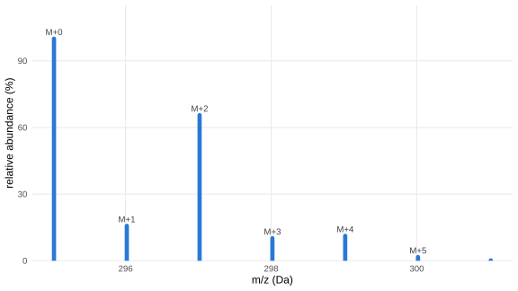
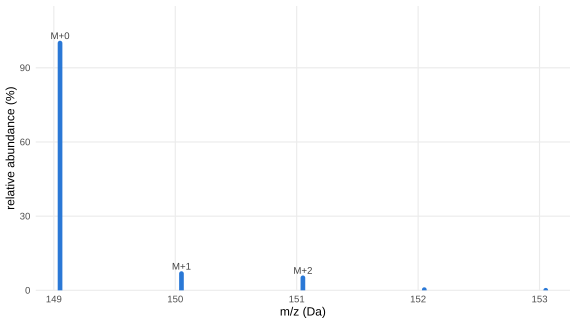
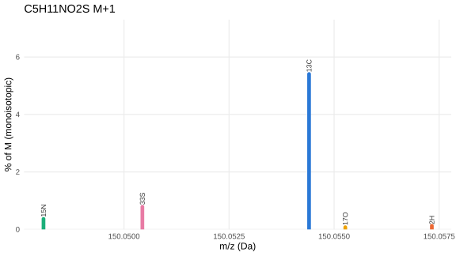
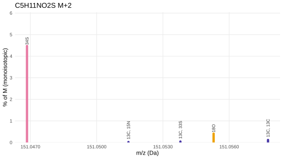

# Isotope fine structure

Isotope fine structure is what happens when a nominal M+2 peak contains
several isotopologues sitting at slightly different exact masses: ³⁴S at
one position, ¹³C¹³C at another, a few millidaltons apart. Every
isotope-pattern calculator reports the coarse M+1/M+2 heights, but those
numbers hide the individual isotopologues. This article explains why
their positions differ, walks through reading them for a concrete
example, and builds the tools to simulate what any instrument would
actually resolve.

## Chlorine’s M+2: an abundance effect

Chlorine has two stable isotopes: ³⁵Cl (75.8% natural abundance,
monoisotopic) and ³⁷Cl (24.2%). A molecule with two chlorines – like
**diclofenac** (C₁₄H₁₁Cl₂NO₂) – has roughly a 37% chance of carrying
exactly one ³⁷Cl, placing that molecule at M+2. The monoisotopic M peak
is simultaneously thinned out as ions scatter across M+1, M+2, M+3 and
M+4 – so M+2 ends up at ~65% of M, an excess so large that no
fine-structure argument is required to recognise it.

Show code

``` r

pat_dic  <- isotope_fine_pattern("C14H11Cl2NO2")
base_dic <- pat_dic %>% filter(label == "") %>% pull(mz)

coarse_dic <- pat_dic %>%
  mutate(nominal = round(mz - base_dic)) %>%
  group_by(nominal) %>%
  summarise(mz = base_dic + first(nominal), abundance = sum(abundance), .groups = "drop")

ggplot(coarse_dic, aes(mz, abundance)) +
  geom_segment(aes(xend = mz, y = 0, yend = abundance),
               colour = BLUE, linewidth = 2.2, lineend = "round") +
  geom_text(data = filter(coarse_dic, abundance > 1),
            aes(label = paste0("M+", nominal)),
            vjust = -0.6, size = 3.4, colour = "grey25") +
  scale_y_continuous(limits = c(0, NA), expand = expansion(mult = c(0, .15))) +
  labs(x = "m/z (Da)", y = "relative abundance (%)") +
  theme_minimal(base_size = 12) +
  theme(panel.grid.minor = element_blank())
```



Diclofenac’s isotope pattern at unit resolution. Two chlorines are
unmissable without any fine-structure argument.

That coarse view is
[`isotope_fine_pattern()`](https://stanstrup.github.io/commonMZ/reference/isotope_fine_pattern.md)’s
output summed by nominal mass, the same number every isotope-pattern
calculator reports. M+2 at ~65% follows directly from ³⁷Cl’s 24.2%
natural abundance.

## Why different elements land at different exact masses

A “nominal +2” peak contains any isotopologue whose mass rounds to 2 Da
above the monoisotopic peak. But exact masses differ: nuclear binding
energy varies between nuclei, so the heavy isotope of each element sits
at its own characteristic offset from the nearest integer.

| Isotopologue | Shift from monoisotopic (Da) | Offset from nominal +2 (mDa) |
|--------------|-----------------------------:|-----------------------------:|
| ¹³C + ¹³C    |                      +2.0067 |                         +6.7 |
| ¹⁸O          |                      +2.0042 |                         +4.2 |
| ³⁷Cl         |                      +1.9971 |                         −2.9 |
| ³⁴S          |                      +1.9958 |                         −4.2 |

The 10.9 mDa gap between ¹³C¹³C and ³⁴S is larger than the mass accuracy
of any modern high-resolution instrument: they are at genuinely
different masses. Whether your spectrum resolves them as two peaks
rather than one depends on resolving power; the sections below work
through that for a concrete example.

## When the coarse pattern hides the answer

**Methionine**, C₅H₁₁NO₂S, is one of the twenty proteinogenic amino
acids, present in every untargeted metabolomics run. It carries one
sulfur, and ³⁴S sits at 4.25% natural abundance, two orders of magnitude
more abundant than the +1 isotopes of the CHNO elements. Nothing about a
coarse M+1/M+2 barcode makes that obvious.

Change `formula` here to run the same workflow for your own candidate:

Show code

``` r

formula <- "C5H11NO2S"   # methionine -- swap to your own candidate

pat     <- isotope_fine_pattern(formula)
base_mz <- pat %>% filter(label == "") %>% pull(mz)
coarse  <- pat %>%
  mutate(nominal = round(mz - base_mz)) %>%
  group_by(nominal) %>%
  summarise(mz = base_mz + first(nominal), abundance = sum(abundance), .groups = "drop")
```

Show code

``` r

ggplot(coarse, aes(mz, abundance)) +
  geom_segment(aes(xend = mz, y = 0, yend = abundance),
               colour = BLUE, linewidth = 2.2, lineend = "round") +
  geom_text(data = filter(coarse, abundance > 1),
            aes(label = paste0("M+", nominal)),
            vjust = -0.6, size = 3.4, colour = "grey25") +
  scale_y_continuous(limits = c(0, NA), expand = expansion(mult = c(0, .15))) +
  labs(x = "m/z (Da)", y = "relative abundance (%)") +
  theme_minimal(base_size = 12) +
  theme(panel.grid.minor = element_blank())
```



Methionine’s coarse isotope pattern. M+2 far exceeds what five carbons
alone would produce, but the bars don’t say why.

Five carbons predict M+2 from double-¹³C at
`choose(5,2) * 0.0107^2 * 100 ≈ 0.11%`, **roughly 40 times smaller**
than the 5.1% actually observed. That gap between the naive ¹³C-only
prediction and the observed M+2 height is itself a diagnostic: whenever
M+2 badly overshoots what carbon alone predicts, suspect S, Cl, Br, Si,
or a metal before anything else. The fine structure below names the
specific isotopologue.

## Step 1: build the fine-structure table

[`isotope_fine_pattern()`](https://stanstrup.github.io/commonMZ/reference/isotope_fine_pattern.md)
reports each isotopologue separately, at its own exact mass, labelled by
which isotopes produced it:

Show code

``` r

pat %>% arrange(mz) %>%
  mutate(mz = round(mz, 5), abundance = round(abundance, 4),
         label = ifelse(label == "", "M (monoisotopic)", label)) %>%
  knitr::kable(caption = paste("Every isotopologue of", formula, "above the default 0.01% threshold."))
```

|       mz | abundance | label            |
|---------:|----------:|:-----------------|
| 149.0511 |  100.0000 | M (monoisotopic) |
| 150.0481 |    0.3653 | 15N              |
| 150.0504 |    0.7896 | 33S              |
| 150.0544 |    5.4079 | 13C              |
| 150.0553 |    0.0762 | 17O              |
| 150.0573 |    0.1265 | 2H               |
| 151.0469 |    4.4742 | 34S              |
| 151.0514 |    0.0198 | 13C, 15N         |
| 151.0538 |    0.0427 | 13C, 33S         |
| 151.0553 |    0.4110 | 18O              |
| 151.0578 |    0.1170 | 13C, 13C         |
| 152.0439 |    0.0163 | 15N, 34S         |
| 152.0502 |    0.2420 | 13C, 34S         |
| 152.0587 |    0.0222 | 13C, 18O         |
| 153.0461 |    0.0105 | 36S              |
| 153.0511 |    0.0184 | 18O, 34S         |

Every isotopologue of C5H11NO2S above the default 0.01% threshold.
{.table .caption-top}

## Step 2: zoom into one nominal level

On the m/z axis, the M+1 and M+2 regions each split into several
distinct peaks:

Show code

``` r

plot_level <- function(pattern, level, title) {
  base <- pattern %>% filter(label == "") %>% pull(mz)
  d <- pattern %>%
    mutate(nominal = round(mz - base)) %>%
    filter(nominal == level) %>%
    mutate(element = sub(",.*", "", label),
           element = sub("^[0-9]+", "", element),
           col = ifelse(label == "" | grepl(",", label), "combo", element),
           col = ifelse(col %in% names(COL), col, "combo"))
  ggplot(d, aes(mz, abundance, colour = col)) +
    geom_segment(aes(xend = mz, y = 0, yend = abundance),
                 linewidth = 2.2, lineend = "round") +
    geom_text(data = slice_max(d, abundance, n = min(6, nrow(d))),
              aes(label = label),
              angle = 90, hjust = -0.15, size = 3.1, colour = "grey20") +
    scale_colour_manual(values = COL, guide = "none") +
    scale_x_continuous(labels = scales::label_number(accuracy = 0.0001)) +
    scale_y_continuous(limits = c(0, NA), expand = expansion(mult = c(0, .35))) +
    labs(x = "m/z (Da)", y = "% of M (monoisotopic)", title = title) +
    theme_minimal(base_size = 12) +
    theme(panel.grid.minor = element_blank())
}
plot_level(pat, 1, paste(formula, "M+1"))
```



M+1: five candidate isotope substitutions, spread across 0.009 Da.
Carbon dominates, as it does for almost every organic ion.

Show code

``` r

plot_level(pat, 2, paste(formula, "M+2"))
```



M+2: 34S alone outweighs every carbon-only combination roughly 40-fold
and sits at a measurably different mass.

Two things the coarse bar chart could not show are visible here. First,
**sulfur’s +2 isotope physically sits apart from every carbon-based
explanation**: `13C, 13C` sits 0.01091 Da away from `34S`, a large
enough gap that they are two genuinely different masses, not two names
for the same peak. Second, the height difference *is* the sulfur signal:
`34S` towers over every combination of carbons, nitrogens and oxygens
that could also reach +2, which is the fine-structure version of the
40-fold excess already spotted in the coarse pattern, now with a
specific competing hypothesis (¹³C¹³C) at a specific, different mass.

## Step 3: would your instrument resolve the candidates?

For every pair of isotopologues at a nominal level, the table below
reports the Orbitrap resolving power (quoted at m/z 200) at which the
two Gaussian peaks would show a ~50% valley between them, enough for a
centroid algorithm to find two separate peaks. Two peaks of equal height
separated by 1.5 × FWHM produce that valley; translating to the R@200
Orbitrap convention scales as `1/sqrt(m/z)`:

Show code

``` r

R_at_mz <- function(mz, R_ref, mz_ref = 200) R_ref * sqrt(mz_ref / mz)

separations <- function(pattern, level, mz_ref = 200, min_abundance = 0.01) {
  base <- pattern %>% filter(label == "") %>% pull(mz)
  d <- pattern %>%
    mutate(nominal = round(mz - base)) %>%
    filter(nominal == level, abundance >= min_abundance) %>%
    mutate(label = ifelse(label == "", "M", label))
  if (nrow(d) < 2) return(tibble())
  ix <- combn(seq_len(nrow(d)), 2)
  map_dfr(seq_len(ncol(ix)), function(i) {
    ra <- d[ix[1, i], ]; rb <- d[ix[2, i], ]
    sep_da   <- abs(ra$mz - rb$mz)
    m_avg    <- (ra$mz + rb$mz) / 2
    Rreq     <- 1.5 * m_avg / sep_da
    Rref_req <- Rreq / sqrt(mz_ref / m_avg)
    tibble(a = ra$label, b = rb$label,
           abundance_a_pct = round(ra$abundance, 3),
           abundance_b_pct = round(rb$abundance, 3),
           separation_Da = round(sep_da, 5),
           R_at_mz = round(Rreq), R_at200 = round(Rref_req))
  }) %>% arrange(R_at200)
}

sep2 <- separations(pat, 2)
sep2 %>%
  knitr::kable(col.names = c("a", "b", "abundance a %", "abundance b %",
                              "separation (Da)", "R at this m/z", "R @200"),
               caption = "Every pair of M+2 candidates above 0.01% abundance. R@200 is the Orbitrap resolving power at which the two peaks show a ~50% valley.")
```

| a | b | abundance a % | abundance b % | separation (Da) | R at this m/z | R @200 |
|:---|:---|---:|---:|---:|---:|---:|
| 34S | 13C, 13C | 4.474 | 0.117 | 0.01091 | 20761 | 18043 |
| 34S | 18O | 4.474 | 0.411 | 0.00845 | 26815 | 23304 |
| 34S | 13C, 33S | 4.474 | 0.043 | 0.00695 | 32617 | 28346 |
| 13C, 15N | 13C, 13C | 0.020 | 0.117 | 0.00632 | 35852 | 31158 |
| 34S | 13C, 15N | 4.474 | 0.020 | 0.00459 | 49323 | 42864 |
| 13C, 33S | 13C, 13C | 0.043 | 0.117 | 0.00397 | 57117 | 49638 |
| 13C, 15N | 18O | 0.020 | 0.411 | 0.00386 | 58761 | 51067 |
| 18O | 13C, 13C | 0.411 | 0.117 | 0.00246 | 91962 | 79921 |
| 13C, 15N | 13C, 33S | 0.020 | 0.043 | 0.00235 | 96300 | 83690 |
| 13C, 33S | 18O | 0.043 | 0.411 | 0.00150 | 150740 | 131003 |

Every pair of M+2 candidates above 0.01% abundance. R@200 is the
Orbitrap resolving power at which the two peaks show a ~50% valley.
{.table .caption-top}

Show code

``` r

best <- sep2 %>% slice_min(separation_Da, n = 1) %>% slice(1)
cat(sprintf("The closest pair (`%s` vs `%s`, %.4f Da apart) needs R ~ %s @200 to resolve as two peaks.",
            best$a, best$b, best$separation_Da, format(best$R_at200, big.mark = ",")))
```

The closest pair (`13C, 33S` vs `18O`, 0.0015 Da apart) needs R ~
131,003 @200 to resolve as two peaks.

## Step 4: simulate the profile

[`isotope_profile()`](https://stanstrup.github.io/commonMZ/reference/isotope_profile.md)
turns the fine-structure table into simulated peak shapes at any
resolving power. Pass it the *actual* resolving power at this m/z,
converting from the instrument’s `R @ 200` specification with
`R_at_mz()`:

Show code

``` r

Rs <- c(15000, 60000, 120000)
R_label <- function(r) sprintf("R = %s @200", format(r, big.mark = ",", trim = TRUE))
pat2 <- pat %>% mutate(nominal = round(mz - base_mz)) %>% filter(nominal == 2)

prof <- map_dfr(Rs, function(r)
  isotope_profile(pat2, resolution = R_at_mz(mean(pat2$mz), r)) %>%
    mutate(R = R_label(r)))

p <- ggplot(prof, aes(mz, intensity)) +
  geom_area(fill = BLUE, alpha = .25) +
  geom_line(colour = BLUE, linewidth = .8) +
  geom_rug(data = pat2, aes(x = mz),
           inherit.aes = FALSE, sides = "b", colour = "grey30", linewidth = .6) +
  facet_wrap(~ factor(R, levels = map_chr(Rs, R_label)), ncol = 1, scales = "free_y") +
  scale_x_continuous(labels = scales::label_number(accuracy = 0.0001)) +
  labs(x = "m/z (Da)", y = "simulated intensity (% of M)") +
  theme_minimal(base_size = 12) +
  theme(panel.grid.minor = element_blank(), strip.text = element_text(hjust = 0))
ggplotly(p, tooltip = c("x", "y"))
```

At 15,000 the ³⁴S peak is a single, slightly lopsided blob; the ¹³C¹³C
shoulder is in there but invisible. By 60,000 it is an unmistakable
second peak. Fine structure is not a yes/no property of a molecule; it
is a question you can only answer once you know both *what* could be
there and *whether your instrument could show it to you*.

## Reference: first and second isotope fine structure

The charts below position every M+1 (first isotope) and M+2 (second
isotope) isotopologue by its mass offset from the **carbon reference
peak** — ¹³C for M+1, ¹³C,¹³C for M+2 — normalized so the tallest bar
reaches 1. This shows at a glance which non-carbon elements contribute
and how far they sit from the carbon signal on the m/z axis.

### First isotope (M+1)

Show code

``` r

m1 <- iso_ref_data(pat, 1, "13C")
plot_iso_ref(m1, "¹³C", 1)
```

M+1 fine structure: each bar is one isotopologue; x-axis is mass offset
from ¹³C. The carbon peak sits at zero by definition. Hover for exact
values.

Show code

``` r

m1 %>%
  select(label, offset, abundance) %>%
  rename(isotopologue              = label,
         `offset from 13C (Da)`   = offset,
         `abundance (% of M)`     = abundance) %>%
  knitr::kable(digits = 5,
               caption = paste("M+1 isotopologues of", formula, "by mass offset from ¹³C."))
```

| isotopologue | offset from 13C (Da) | abundance (% of M) |
|:-------------|---------------------:|-------------------:|
| 15N          |             -0.00632 |            0.36533 |
| 33S          |             -0.00397 |            0.78956 |
| 13C          |              0.00000 |            5.40786 |
| 17O          |              0.00086 |            0.07619 |
| 2H           |              0.00292 |            0.12651 |

M+1 isotopologues of C5H11NO2S by mass offset from ¹³C. {.table
.caption-top}

Show code

``` r

separations(pat, 1) %>%
  knitr::kable(col.names = c("a", "b", "abundance a %", "abundance b %",
                              "separation (Da)", "R at this m/z", "R @200"),
               caption = "Pairwise separations between M+1 candidates above 0.01% abundance.")
```

| a   | b   | abundance a % | abundance b % | separation (Da) | R at this m/z | R @200 |
|:----|:----|--------------:|--------------:|----------------:|--------------:|-------:|
| 15N | 2H  |         0.365 |         0.127 |         0.00924 |         24354 |  21095 |
| 15N | 17O |         0.365 |         0.076 |         0.00718 |         31339 |  27145 |
| 33S | 2H  |         0.790 |         0.127 |         0.00689 |         32673 |  28301 |
| 15N | 13C |         0.365 |         5.408 |         0.00632 |         35614 |  30848 |
| 33S | 17O |         0.790 |         0.076 |         0.00483 |         46609 |  40372 |
| 33S | 13C |         0.790 |         5.408 |         0.00397 |         56737 |  49145 |
| 13C | 2H  |         5.408 |         0.127 |         0.00292 |         77033 |  66725 |
| 15N | 33S |         0.365 |         0.790 |         0.00235 |         95660 |  82858 |
| 17O | 2H  |         0.076 |         0.127 |         0.00206 |        109271 |  94650 |
| 13C | 17O |         5.408 |         0.076 |         0.00086 |        261104 | 226164 |

Pairwise separations between M+1 candidates above 0.01% abundance.
{.table .caption-top}

### Second isotope (M+2)

Show code

``` r

m2 <- iso_ref_data(pat, 2, "13C, 13C")
plot_iso_ref(m2, "¹³C,¹³C", 2)
```

M+2 fine structure: x-axis is mass offset from ¹³C,¹³C. Elements with
lower exact mass than two carbons (S, Cl, Br…) appear at negative
offsets. Hover for exact values.

Show code

``` r

m2 %>%
  select(label, offset, abundance) %>%
  rename(isotopologue                   = label,
         `offset from 13C,13C (Da)`    = offset,
         `abundance (% of M)`          = abundance) %>%
  knitr::kable(digits = 5,
               caption = paste("M+2 isotopologues of", formula, "by mass offset from ¹³C,¹³C."))
```

| isotopologue | offset from 13C,13C (Da) | abundance (% of M) |
|:-------------|-------------------------:|-------------------:|
| 34S          |                 -0.01091 |            4.47416 |
| 13C, 15N     |                 -0.00632 |            0.01976 |
| 13C, 33S     |                 -0.00397 |            0.04270 |
| 18O          |                 -0.00246 |            0.41100 |
| 13C, 13C     |                  0.00000 |            0.11698 |

M+2 isotopologues of C5H11NO2S by mass offset from ¹³C,¹³C. {.table
.caption-top}

Show code

``` r

separations(pat, 2) %>%
  knitr::kable(col.names = c("a", "b", "abundance a %", "abundance b %",
                              "separation (Da)", "R at this m/z", "R @200"),
               caption = "Pairwise separations between M+2 candidates above 0.01% abundance.")
```

| a | b | abundance a % | abundance b % | separation (Da) | R at this m/z | R @200 |
|:---|:---|---:|---:|---:|---:|---:|
| 34S | 13C, 13C | 4.474 | 0.117 | 0.01091 | 20761 | 18043 |
| 34S | 18O | 4.474 | 0.411 | 0.00845 | 26815 | 23304 |
| 34S | 13C, 33S | 4.474 | 0.043 | 0.00695 | 32617 | 28346 |
| 13C, 15N | 13C, 13C | 0.020 | 0.117 | 0.00632 | 35852 | 31158 |
| 34S | 13C, 15N | 4.474 | 0.020 | 0.00459 | 49323 | 42864 |
| 13C, 33S | 13C, 13C | 0.043 | 0.117 | 0.00397 | 57117 | 49638 |
| 13C, 15N | 18O | 0.020 | 0.411 | 0.00386 | 58761 | 51067 |
| 18O | 13C, 13C | 0.411 | 0.117 | 0.00246 | 91962 | 79921 |
| 13C, 15N | 13C, 33S | 0.020 | 0.043 | 0.00235 | 96300 | 83690 |
| 13C, 33S | 18O | 0.043 | 0.411 | 0.00150 | 150740 | 131003 |

Pairwise separations between M+2 candidates above 0.01% abundance.
{.table .caption-top}

## Checklist

1.  **Build the pattern** with `isotope_fine_pattern(formula)` and check
    the coarse sum against what carbon count alone predicts
    (`nC * 1.07%` for M+1; `choose(nC,2) * 0.0107^2 * 100%` for M+2). A
    large excess flags S, Cl, Br, Si, or a metal.
2.  **Zoom into the nominal level** that shows the excess to see which
    isotopologues are present and how far apart they sit in exact mass
    (in Da, directly on your spectrum’s axis).
3.  **Check the gap against your resolving power** with `separations()`
    before concluding a peak is clean: an unresolved shoulder is not
    evidence the candidate is absent, only that the instrument couldn’t
    show it.
4.  **Simulate the profile** with
    [`isotope_profile()`](https://stanstrup.github.io/commonMZ/reference/isotope_profile.md)
    at your instrument’s actual resolving power (converted from its
    `R @ reference m/z` spec with `R_at_mz()`) to see, rather than
    infer, whether the candidates merge.

`plot_level()` and `separations()` are not exported by commonMZ; only
[`isotope_fine_pattern()`](https://stanstrup.github.io/commonMZ/reference/isotope_fine_pattern.md)
and
[`isotope_profile()`](https://stanstrup.github.io/commonMZ/reference/isotope_profile.md)
are. Both helpers are short enough to copy into your own analysis.

For looking up a delta between two arbitrary peaks against every known
adduct, fragment and repeating-unit difference in commonMZ, see
[*Looking up an unexplained mass
difference*](https://stanstrup.github.io/commonMZ/articles/mass-difference-lookup.md).
